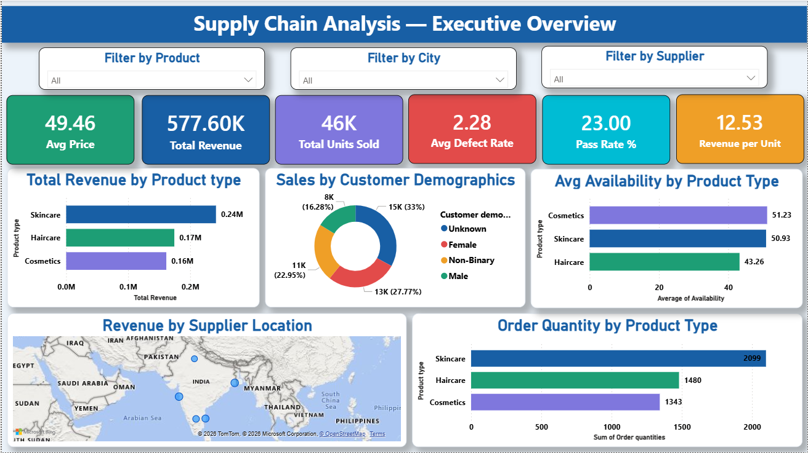
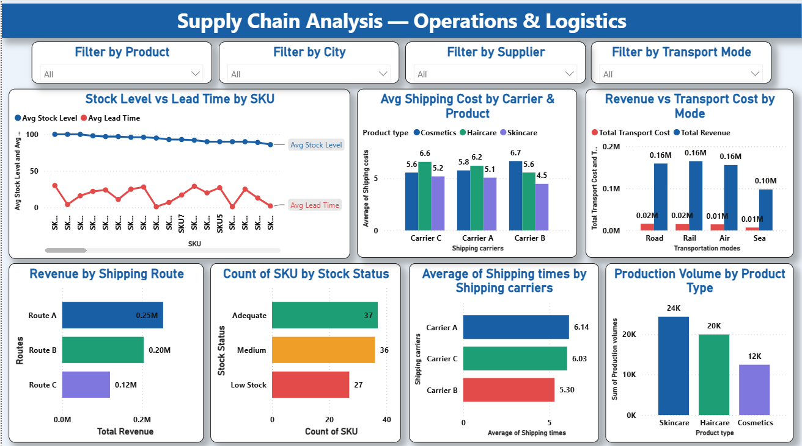
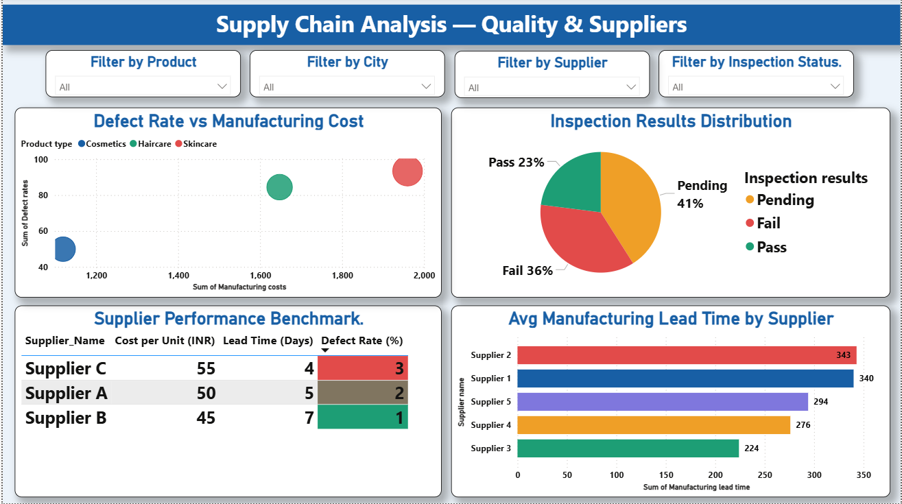

# 📊 Supply Chain Analysis Dashboard

## Project Overview
This project is an interactive Power BI dashboard built to analyze supply chain performance across 23 attributes — covering revenue, logistics, quality control and supplier performance. It helps businesses monitor product performance, shipping efficiency, stock health and supplier reliability.

## Dashboard Preview

### Page 1 — Executive Overview

### Page 2 — Operations & Logistics

### Page 3 — Quality & Suppliers

---

## Objectives
- Analyze overall revenue and product performance
- Track stock levels, lead times and production volumes
- Evaluate logistics efficiency across carriers, routes and transport modes
- Identify top-performing and underperforming suppliers using defect rates
- Monitor quality control through inspection results

---

## Tools & Technologies Used
- Power BI
- Power Query
- DAX
- SQL
- Microsoft Excel
- CSV Files

---

## Dataset Information
This project uses two source files:
- `supply_chain_data.csv` — 100 records, 24 columns covering product, sales, logistics and quality attributes
- `supplier_performance.csv` — Supplier benchmark data (cost per unit, lead time, defect rate)

---

## Key Performance Indicators (KPIs)

| KPI | Value |
|---|---|
| Total Revenue | ₹577.60K |
| Total Units Sold | 46K |
| Avg Defect Rate | 2.28% |
| Pass Rate % | 23% |
| Avg Price | ₹49.46 |
| Revenue per Unit | ₹12.53 |

---

## Dashboard Features
- 5 Interactive Slicers synced across all pages — Product, City, Supplier, Transport Mode, Inspection Status
- KPI Cards, Bar/Column Charts, Donut Chart, Pie Chart, Scatter Chart, Map, Table
- Conditional Formatting on Supplier Performance table
- Traffic light color coding on Stock Status chart

---

## Key Insights
- Skincare leads revenue at ₹242K (42% of total) and highest order quantity at 2,099 units
- Only 23% of items pass quality inspection — 41% pending, 36% failed
- Supplier B is the best performer — lowest cost (₹45/unit) and lowest defect rate (1%)
- 27 SKUs are at Low Stock level — immediate reorder required
- Rail transport generates highest revenue (₹165K) at lowest cost — most efficient mode

---

## Repository Structure
Supply-Chain-Analysis-Dashboard/

│

├── Supply_Chain_Analysis.pbix          → Power BI dashboard file

├── supply_chain_data.csv               → Main dataset

├── supplier_performance.csv            → Supplier benchmark dataset

├── page1_executive_overview.png        → Dashboard screenshot - Page 1

├── page2_operations_logistics.png      → Dashboard screenshot - Page 2

├── page3_quality_suppliers.png         → Dashboard screenshot - Page 3

├── SUPPLY CHAIN ANALYSIS.pptx          → Project presentation

└── README.md
---

## How to Use
1. Download or clone this repository
2. Open `Supply_Chain_Analysis.pbix` in Power BI Desktop
3. If prompted, update the file paths in Power Query to point to the CSV files
4. Refresh the data
5. Explore the interactive dashboard

---

## Author
**Samiulla Nadaf**

📧 samiullanadaf001@gmail.com
